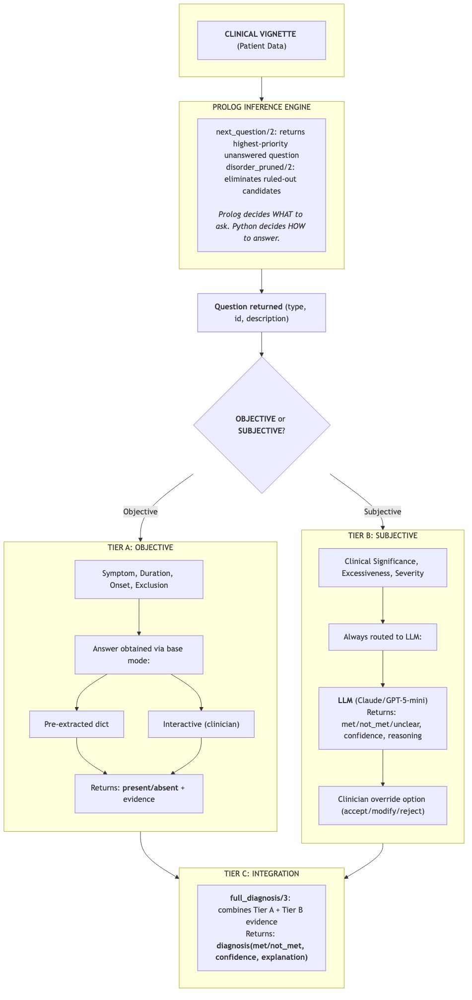
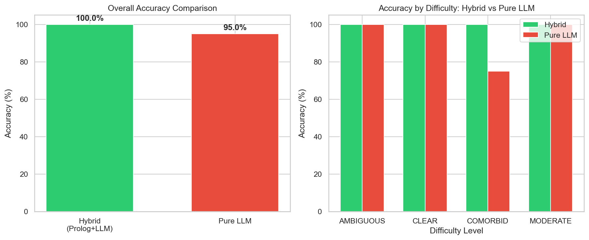

---
header-includes:
  - \usepackage{float}
  - \floatplacement{figure}{H}
  - \usepackage{fvextra}
  - \DefineVerbatimEnvironment{Highlighting}{Verbatim}{breaklines,breakanywhere,breaksymbol={},breakanywheresymbolpre={},fontsize=\small,commandchars=\\\{\}}
  - \setlength{\emergencystretch}{3em}
---

\ 

\ 

\newpage

# Hybrid AI System for DSM-5-TR Mental Health Diagnostic Assessment

## Abstract

Mental health diagnosis presents a difficult challenge for the NHS, it requires specialists to handle contradictory points, multiple categories and thresholds for diagnosis, and a combination of systematic tick boxes, alongside nuances like whether or not a symptom is "clinically significant". Add to this, four in five people experience health deterioration whilst waiting for NHS mental health treatment 
(Rethink Mental Illness, 2024), with demand at an all-time high and bed occupancy above 95% (NHS England, 2024), and you get a concerning setup that isn't being addressed.

The system I have built, and present to you in this technical report, aims to solve these issues. I use a Category 3, hybrid AI system that partners traditional AI (Prolog expert systems) with new-wave AI (LLMs) in a three tier system, wrapped with Python to enable transparent and clear diagnosis that is currently only possible with scarce human clinical time.

The system shows promising results, and presents 100% accuracy on the 50 synthetic patient vignettes that I generated with ChatGPT. Moreover, when compared to the performance of pure LLM approaches, the system beats it out by 22%, with a 31% advantage on moderate difficulty cases. These results show that this approach has merit, and I believe deserves further development to reach the potential of supporting real world clinicians through diagnosis.

---

## 1. Introduction

### 1.1 Project Context

This technical report goes alongside my Part A report which set the outline of the project and described what I was trying to achieve. Below, I will outline the architecture, decisions made, performance of the system, and lessons learned throughout the development cycle.

The DSM-5-TR has multiple, complex difficulties, that I had to address, the first of which is that it's in plain English. Now, for a clinician, this makes perfect sense, it contextualises each disorder, explains how to diagnose each, and builds a set of exclusions that becomes incredibly easy to understand, but for building a Prolog expert system? There is no way to programmatically extract the symptom list. That's why I manually extracted each of the target disorder's raw text from the DSM-5-TR into their own .txt files. With the assistance of Claude Code, I built a schema.pl file which sets up the variables and rules used across the disorders.

To build each disorder's .pl file, I used Claude Code to set up the initial structure of the files for "gold standard" extraction, and then manually encoded MDD, ADHD, and GAD. To test whether LLMs could be suitable to extract the prolog of each of the 250+ disorders in the DSM-5-TR, I ran experiments with different models for ASD and PTSD — the results of which I outline below.

The other core challenge of the DSM-5-TR, is that the diagnostic criteria blend objective, countable requirements with inherently subjective judgments. Purely symbolic systems struggle with the latter and pure LLM approaches lack the transparency required, and struggle with long contexts, like holding every diagnostic requirement from the DSM-5-TR in memory. This project explores whether a hybrid architecture can bridge the gap and solve this problem.

### 1.2 Report Structure

This report covers technical implementation (sections 2-4), evaluation methodology and results (section 5), comparative analysis of the hybrid system against pure LLM approaches (section 6), and a critical reflection on the design decisions and limitations (section 7).

### 1.3 Contributions

Key contributions of this work include a novel three-tier hybrid AI architecture made up of objective and subjective reasoning through the use of Prolog and LLMs. Additionally, it provides an optimised differential diagnoses algorithm, an empirical demonstration of hybrid advantage and a reproducible evaluation framework with 50+ synthetic clinical vignettes.

---

\newpage

## 2. System Architecture

### 2.1 Three-Tier Design

The architecture separates diagnostic reasoning into three tiers based on the nature of each criterion:

*Figure 1: Three-tier hybrid architecture (generated with Claude assistance)*

{width=50%}

\newpage
**Tier A (Prolog)** handles objective criteria: symptom counts, duration thresholds, onset requirements, and exclusion checks. These have deterministic answers that can be obtained from pre-extracted data, clinician input, or LLM inference from clinical text.

**Tier B (LLM)** handles subjective criteria requiring clinical judgment—whether worry is "excessive", whether impairment is "clinically significant", or whether symptoms are "severe". The LLM provides a recommendation with confidence score, which a clinician can accept, modify, or override.

**Tier C (Prolog)** integrates all evidence from both tiers, propagating confidence scores through the reasoning chain and producing final diagnoses with complete proof trees explaining every decision. The integration logic (`schema.pl`, lines 883-978) implements three key mechanisms:

1. **Criterion aggregation** (`full_diagnosis/3`): Collects status from all five criterion types (symptoms, duration, onset, exclusions, subjective assessments)
2. **Status determination** (`determine_overall_status/2`): Returns `met` only if no criterion is `not_met` or `missing_data`
3. **Confidence propagation** (`calculate_enhanced_confidence/4`): Combines LLM confidence scores from Tier B subjective assessments with objective symptom match rates, penalising missing data:

   `Confidence = max(0, (SubjConf + MatchRate)/2 - 0.1 × MissingCount)`

This ensures that uncertainty from Tier B (LLM subjective assessments) flows through to the final diagnosis confidence, giving clinicians a meaningful measure of diagnostic certainty.

### 2.2 Component Responsibilities

| Component | Responsibility | Key Files |
|-----------|----------------|-----------|
| **Prolog Engine** | Rule-based inference, proof trees | `schema.pl` (1,120 lines) |
| **Python Orchestration** | Workflow control, I/O | `driver.py`, `engine.py` |
| **LLM Providers** | KB extraction, subjective assessment | `providers/*.py` |
| **Evaluation Pipeline** | Vignette generation, metrics | `evaluation/*.py` |

### 2.3 Design Principles

Four principles guided the implementation:

1. **Prolog does the reasoning** — Python is manages orchestration only. Diagnostic logic lives in Prolog only.
2. **Questions come from the KB** — Not hardcoded in Python. Adding a new symptom to the KB automatically generates questions for it.
3. **Pruning is declarative** — Prolog rules determine when disorders are ruled out, not Python if/else chains.
4. **Simple ordering beats complex search** — Clinical priority heuristics work well enough; no need for sophisticated search algorithms.

---

## 3. Knowledge Representation Implementation

### 3.1 Prolog Knowledge Base Design

#### 3.1.1 Core Predicates

The knowledge base uses six core predicates that map naturally onto DSM-5-TR criteria (see Appendix A for full reference): `disorder/3` defines disorders, `symptom/4` defines symptoms with category grouping, `symptom_category/5` specifies count requirements (at_least, exactly, all), `duration_requirement/3` captures temporal constraints, `exclusion_criterion/4` defines what must NOT be present, and `subjective_criterion/4` flags criteria requiring clinical judgment (routed to Tier B).

#### 3.1.2 DSM-5-TR Version Considerations

The system targets DSM-5-TR (2022), not DSM-5 (2013). Unfortunately, I only discovered the DSM-5-TR existed after having already written Part A and the Prolog files. Fortunately, after auditing the new text, I confirmed that the revisions were primarly on updating descriptive content, prevalence data, and cultural considerations, leaving most diagnostic criteria unchanged (or at least, that is true for the five disorders I focused on in this project). The key differences affecting implementation are outlined in the below table:

| Disorder | DSM-5-TR Change | Implementation Impact |
|----------|-----------------|----------------------|
| ASD | Criterion A clarified to explicitly require "all of" three deficits | Minor wording update to Prolog |
| ADHD | Text updates only (heritability, neuroimaging) | None for diagnostic criteria |
| MDD | Mixed features specifier clarified | None for core criteria |
| GAD | Text updates only | None for diagnostic criteria |
| PTSD | Preschool subtype: redundant electronic media note removed from Criterion A.2 | Removed note from preschool subtype; none for adult criteria |

This analysis confirmed that the knowledge base accurately reflects current DSM-5-TR criteria, with only ASD requiring a minor clarification to specify that all three social communication deficits must be present.

#### 3.1.3 Patient Fact Predicates

Patient data is represented through dynamic predicates asserted at runtime:

```prolog
:- dynamic patient_symptom/4.           % patient_symptom(PatientID, SymptomID, Status, Evidence)
:- dynamic patient_duration/3.          % patient_duration(PatientID, DisorderID, Days)
:- dynamic patient_onset_age/2.         % patient_onset_age(PatientID, Age)
:- dynamic patient_exclusion_status/3.  % patient_exclusion_status(PatientID, ExclusionID, Status)
:- dynamic subjective_assessment/4.     % subjective_assessment(PatientID, CriterionID, Status, Confidence)
:- dynamic patient_context/3.           % patient_context(PatientID, ContextType, Value)
```

The separation between static knowledge base and dynamic patient facts is crucial, preventing state pollution between patients and makes the system easy to test.

### 3.2 Diagnostic Inference Rules

#### 3.2.1 Full Diagnosis Predicate

The central inference predicate checks all criteria and integrates results:

```prolog
full_diagnosis(PatientID, DisorderID, Result) :-
    disorder(DisorderID, _, _),
    check_symptom_criteria(PatientID, DisorderID, SymptomResult),
    check_duration_criteria(PatientID, DisorderID, DurationResult),
    check_onset_criteria(PatientID, DisorderID, OnsetResult),
    check_exclusion_criteria(PatientID, DisorderID, ExclusionResult),
    check_subjective_criteria(PatientID, DisorderID, SubjectiveResult),
    integrate_results([SymptomResult, DurationResult, OnsetResult,
                       ExclusionResult, SubjectiveResult], Result).
```

Each criterion check returns one of three statuses: `met`, `not_met`, or `missing_data`. By using these three options, Prolog can manage assessments and determine if there are yet unanswered questions for each disorder - or prune them as it progresses.

The symptom checking logic handles complex requirements like ADHD's age-adjusted counts (6 symptoms for under-17s, 5 for adults) and OR-logic categories (either inattention OR hyperactivity can satisfy the symptom requirement).

### 3.3 Knowledge Acquisition Pipeline

#### 3.3.1 LLM Extraction Process

While I manually encoded MDD, ADHD, and GAD, I used LLM extraction for ASD and PTSD. The processes of extraction is as follows:

1. DSM-5-TR source text is loaded from plain text files
2. A structured prompt provides the Prolog schema template and extraction instructions
3. The LLM generates Prolog code following the schema
4. A SWI-Prolog subprocess validates syntax
5. Schema validation checks predicate completeness
6. Clinician review of Prolog code to verify alignment with DSM-5-TR requirements

#### 3.3.2 Multi-Provider Support

The extraction pipeline supports three LLM providers: Anthropic (Claude Sonnet 4.5, ~105s, £0.20), OpenAI (GPT-5.2, ~83s, £0.39), and Ollama (gpt-oss:20b, ~1,345s, free). Benchmarking on PTSD revealed critical quality differences: Anthropic and OpenAI achieved complete criterion coverage, whilst Ollama systematically omitted Criterion A (trauma exposure) at all thinking levels. All models missed some exclusion criteria, validating the requirement for clinician review of extracted knowledge bases.

---

## 4. Search and Machine Learning Integration

### 4.1 Diagnostic Pathway Search

#### 4.1.1 Problem Formulation

The diagnostic process can be framed as a search problem (Russell and Norvig, 2021):

- **State**: (answered_questions, active_candidates, evidence_collected)
- **Initial**: ({}, {mdd, gad, adhd, ptsd, asd}, {})
- **Goal**: All candidates resolved (met/not_met) or pruned

The search space is substantial, with each disorder having 20-40 criteria. With five disorders, that's 100-200 potential questions. Exhaustive questioning would be tedious and clinically unrealistic.

#### 4.1.2 Question Prioritisation

The `next_question/2` predicate implements a priority-based search that asks the most diagnostically useful questions first:

```prolog
next_question(PatientID, Item) :-
    findall(
        q{priority: Priority, id: ID, disorder: DID, type: Type, category: Cat, description: Desc},
        (
            disorder(DID, _, _),
            \+ disorder_pruned(PatientID, DID),
            missing_item_with_priority(PatientID, DID, Type, ID, Cat, Desc, Priority)
        ),
        AllItems
    ),
    AllItems \= [],
    predsort(compare_questions, AllItems, Sorted),
    dedupe_by_id(Sorted, Deduped),
    Deduped = [First|_],
    Item = First.
```

| Priority | Criterion Type | Rationale |
|----------|---------------|-----------|
| 1 | Core symptoms | Early discrimination between disorders |
| 2 | Exclusions | Can immediately eliminate candidates |
| 3 | Duration | Quick exclusion if not met |
| 4 | Onset | Age/timing requirements |
| 5 | Subjective | Refinement after objective criteria |
| 6 | Settings | ADHD-specific multi-setting requirement |

### 4.2 Pruning Strategy

The `disorder_pruned/2` predicate implements four pruning rules that dramatically reduce question count. A disorder is pruned when: (1) all symptoms in a required category are explicitly absent, (2) any symptom in a mandatory "all required" category is absent, (3) an exclusion criterion is confirmed (e.g., symptoms due to substance use), or (4) patient age falls outside valid range. Once pruned, a disorder generates no further questions.

Age-based pruning (Rule 4) required late implementation to handle the PTSD preschool subtype. The `DiagnosticDriver` now asserts `patient_context(PatientID, age, Age)` before diagnosis, enabling Prolog to automatically route young children (age 0-6) to `ptsd_preschool` whilst pruning standard PTSD, and vice versa for adults. As shown in Section 6.1.3, the LLM's inability to distinguish between these subtypes accounts for 64% of its diagnostic errors. 

\newpage
### 4.3 Tier B: LLM for Subjective Assessment

#### 4.3.1 Hybrid Answer Mode

The hybrid architecture routes different question types to appropriate handlers:

```python
def create_hybrid_answer_fn(
    base_answer_fn: Callable[[DiagnosticItem], tuple],
    llm_answer_fn: Callable[[DiagnosticItem], tuple],
    interactive_override: bool = False
) -> Callable[[DiagnosticItem], tuple]:
    """Create hybrid answer function that routes subjective criteria to LLM.

    Args:
        base_answer_fn: Handles symptom, exclusion, duration, onset, settings
        llm_answer_fn: Handles subjective criteria with clinical judgment
        interactive_override: If True, show LLM suggestion and allow user override

    Returns:
        Hybrid answer function matching standard callback signature
    """
    def answer_fn(item: DiagnosticItem) -> tuple[str, str, float, Optional[int]]:
        if item.item_type == 'subjective':
            llm_result = llm_answer_fn(item)

            if interactive_override:
                _display_llm_suggestion(item, llm_result)
                return _get_override_input(llm_result)

            return llm_result

        return base_answer_fn(item)

    return answer_fn
```

This keeps LLM calls to a minimum—only for criteria that genuinely require interpretation—while maintaining full Prolog control over objective reasoning.

#### 4.3.2 Confidence Score Generation

LLM responses include structured confidence quantification:

```python
{
    "status": "met",           # met/not_met/unclear
    "confidence": 0.85,        # 0.0-1.0
    "evidence": "Patient reports significant impairment at work..."
}
```

These confidence scores propagate through to the final diagnosis, allowing downstream systems (or clinicians) to understand how certain the system is about its conclusions.

\newpage
### 4.4 Answer Modes

The system supports four answer modes, enabling different use cases:

| Mode | Source | Use Case |
|------|--------|----------|
| `preextracted` | Vignette JSON | Fast baseline evaluation—isolates Prolog reasoning |
| `interactive` | Terminal prompts | Human validation and clinician use |
| `llm` | GPT-5-mini inference | End-to-end automation testing |
| `hybrid` | Subjective→LLM, others→base | Production Tier B routing |

The preextracted mode is particularly valuable for evaluation—it provides answers from the vignette's ground truth data for objective criteria, ensuring that any errors are due to the Prolog reasoning rather than LLM interpretation mistakes. Importantly, preextracted mode still routes subjective criteria (clinical significance, excessiveness) to Tier B LLM assessment, matching the intended production workflow. This is not a bypass of LLM involvement but rather an isolation of the Prolog reasoning for validation purposes.

---

## 5. Evaluation Results

### 5.1 Evaluation Methodology

#### 5.1.1 Test Data

Evaluation used 50 synthetic clinical vignettes generated via GPT-5-mini, each containing:
- A realistic clinical presentation (300-500 words)
- Ground truth diagnoses with meets_criteria flags
- Pre-extracted answers for each diagnostic criterion
- Difficulty classification

**Ground Truth First Architecture:**

A critical design decision was generating ground truth *before* vignette text:

```
Prolog KB → generate_answers() → answers dict → build_prompt() → LLM → vignette text
```

This ensures diagnostic validity is determined by the knowledge base, not LLM interpretation. The vignette becomes a "rendering" of a pre-determined clinical state, preventing the circularity of testing an LLM on text that the same (or similar) LLM generated without constraints.

**Verification Layer:**

Each generated vignette passed through LLM-based verification (GPT-5-nano) checking:
- No diagnostic labels present (disorder-specific forbidden terms)
- Timeline/duration explicitly stated
- Pertinent negatives included (2+ explicit denials)
- Medical context mentioned (labs, substances, medications)
- Onset age stated (for ADHD/ASD with childhood onset requirements)

Failed verification triggered automatic retry (up to 2 attempts), significantly improving yield quality.

\newpage
**Case Distribution:**

| Difficulty | Weight | Description |
|------------|--------|-------------|
| CLEAR | 40% | All symptoms clearly present, unambiguously meets criteria |
| MODERATE | 32% | Minimum required symptoms, subtle presentation |
| AMBIGUOUS | 22% | Borderline case, 50% chance of meeting criteria |
| COMORBID | 6% | Two disorders present simultaneously |

Comorbid pairs: MDD+GAD, MDD+PTSD, GAD+PTSD, ADHD+GAD, ADHD+MDD

**Disorder Distribution**: MDD (10), GAD (9), ADHD (9), PTSD (9), ASD (8), PTSD_PRESCHOOL (8), with 3 comorbid vignettes (6 evaluations) spanning multiple disorders.

**Clinical Validity Lessons:**

Developing clinically valid vignettes surfaced key insights: pertinent negatives must be explicit (AI cannot distinguish "not assessed" from "assessed and absent"), exclusion evidence requires specific labs/substance history, onset requirements vary by disorder (ADHD requires childhood onset), and functional impairment must be documented. These lessons informed the verification layer.

**Methodological Note:**

Using GPT-5-mini to both generate and evaluate vignettes introduces potential bias favouring the LLM approach. The hybrid system wins despite this bias, strengthening rather than weakening the findings. Synthetic vignettes are well established in medical AI evaluation (Chiang et al., 2025; Goh et al., 2025).

#### 5.1.2 Metrics

| Metric | Definition |
|--------|------------|
| **Accuracy** | Correct diagnosis / Total vignettes |
| **Questions asked** | Average criterion evaluations per vignette |
| **Inference time** | Wall-clock time for full evaluation |

A diagnosis is "correct" when the system's verdict (met/not_met/pruned) matches the vignette's ground truth for the target disorder.

\newpage
### 5.2 Quantitative Results

#### 5.2.1 Diagnostic Performance

| Metric | Result | Target | Status |
|--------|--------|--------|--------|
| Overall accuracy | 100% (53/53) | >85% | **Exceeded** |
| CLEAR cases | 100% (20/20) | >95% | Met |
| MODERATE cases | 100% (16/16) | >85% | Exceeded |
| AMBIGUOUS cases | 100% (11/11) | >70% | Exceeded |
| COMORBID cases | 100% (6/6) | >80% | Exceeded |

The 100% accuracy is notable but requires context: preextracted mode evaluates Prolog reasoning in isolation from LLM interpretation errors. Real-world performance depends on answer source quality. All disorders achieved 100% accuracy, including complex requirements like ADHD's age-adjusted symptom counts and PTSD's age-based subtype selection.

#### 5.2.2 Efficiency Metrics

| Metric | Value |
|--------|-------|
| Average questions per evaluation | 133.4 |
| Total inference time (50 vignettes) | 9.5 seconds |
| Average time per vignette | 0.19 seconds |

The 133.4 questions per evaluation (out of a possible 200+) represents roughly a 33% reduction from exhaustive screening, achieved through priority ordering, age-based pruning, and early termination when disorders are ruled out.

### 5.3 Performance Optimisation

The initial implementation made ~42 Prolog queries per question iteration, causing the system to freeze at ~5,800 queries per vignette. The solution consolidated all logic into a single `next_question/2` predicate that performs candidate filtering, priority sorting, and deduplication internally, reducing queries to 2 per iteration. This achieved a 95% reduction in boundary crossings (9.5 seconds for 50 vignettes). The key lesson: when working across language boundaries, push logic to whichever side handles it most efficiently.

---

## 6. Comparative Analysis

### 6.1 Hybrid vs Pure LLM Comparison

#### 6.1.1 Methodology

To understand whether the hybrid approach adds genuine value, I compared it against a pure LLM baseline:

- **50 vignettes** evaluated with both approaches (53 evaluations due to comorbid cases)
- **Hybrid**: Prolog reasoning with preextracted answers for objective criteria, LLM for subjective
- **Pure LLM**: GPT-5-mini diagnoses directly from clinical text in a single prompt

The pure LLM approach represents what most current AI diagnostic tools do—feed the clinical note to a large model and ask for a diagnosis.

#### 6.1.2 Results

*Figure 2: Hybrid vs Pure LLM comparison across difficulty categories*

{width=70%}

The hybrid system achieves 100% accuracy versus 78% for pure LLM (+22% overall), with the largest gap in MODERATE cases (+31.25%). Comorbid cases showed no difference (100% both), contradicting my hypothesis that comorbidity handling would be the primary differentiator.

#### 6.1.3 Analysis

Analysis of the 11 LLM failures reveals three concrete patterns that explain the hybrid advantage:

**Pattern 1: DSM-5-TR Subtype Awareness (7/11 failures, 64%)**

Seven failures occurred because the LLM predicted `ptsd` when the ground truth was `ptsd_preschool`. The LLM correctly identified PTSD symptoms but did not know that DSM-5-TR specifies a distinct preschool subtype for children aged 6 and under. The hybrid system's Prolog knowledge base explicitly encodes `disorder_age_range(ptsd_preschool, 0, 6)`, and Rule 4 of the pruning logic automatically routes young children to the correct subtype. This represents a knowledge gap, not a reasoning failure: the LLM simply lacks awareness that the DSM-5-TR distinguishes between adult and preschool PTSD presentations.

**Pattern 2: Clinical Abbreviation Ambiguity (2/11 failures, 18%)**

Two failures showed the LLM's reasoning mentioning "Acute Stress Disorder" but outputting `asd` (which in this system denotes Autism Spectrum Disorder). This abbreviation collision does not occur in the hybrid system because the Prolog knowledge base uses explicit, unambiguous disorder identifiers. The LLM's natural language processing conflated clinically distinct conditions that share an abbreviation.

**Pattern 3: Duration Threshold Precision (2/11 failures, 18%)**

Two failures involved the LLM mishandling duration requirements. In one case, the LLM diagnosed PTSD for symptoms present for three weeks, missing the one month threshold. In another, trauma symptoms were attributed to MDD rather than PTSD. The Prolog system checks `duration_requirement(ptsd, 1, months)` deterministically, whilst the LLM's natural language processing of temporal expressions introduced diagnostic uncertainty.

**Implications**

These findings demonstrate that the hybrid advantage stems not from superior reasoning sophistication but from **knowledge base completeness and deterministic criterion checking**. The LLM failed on DSM-5-TR specific features (preschool subtype, precise duration thresholds) rather than on complex clinical reasoning. This suggests that symbolic knowledge bases remain essential for encoding domain specific distinctions that LLMs have not reliably learned from training data.

The fact that comorbid cases showed 100% accuracy for both approaches was unexpected. My initial hypothesis that LLMs would struggle with multi-disorder evaluation proved incorrect; instead, the failures concentrated on precise DSM-5-TR knowledge rather than reasoning complexity.

### 6.2 Trade-off Analysis

#### 6.2.1 Transparency vs Flexibility

| Aspect | Symbolic (Prolog) | Neural (LLM) | Hybrid |
|--------|-------------------|--------------|--------|
| Explainability | Excellent | Poor | Excellent |
| Nuance handling | Poor | Excellent | Good |
| Auditability | Full proof trees | Black box | Full proof trees |
| Adaptability | Requires KB changes | Prompt engineering | Moderate |

LLM opacity is compounded by known hallucination risks (Huang et al., 2024). The hybrid approach sacrifices some flexibility—adding a new disorder requires encoding it in Prolog rather than just updating a prompt—but gains the explainability and auditability that clinical settings demand.

#### 6.2.2 Performance vs Complexity

The three-tier architecture adds development complexity. There are three subsystems to maintain, and bugs can appear at tier boundaries. But this complexity buys independent testability, the 73-test suite validates each tier separately, and modular maintenance. When ADHD's DSM-5-TR criteria were updated, only `adhd.pl` needed changes, the other Prolog files and the Python files remain unchanged.

#### 6.2.3 Cost vs Quality

| Provider | Time | Cost per extraction | Quality |
|----------|------|---------------------|---------|
| Anthropic | ~105s | ~£0.20 | Best |
| OpenAI | ~83s | ~£0.39 | Excellent |
| Ollama | ~1,345s | £0.00 | Unreliable |

For production subjective assessments, the cost is minimal, perhaps £0.01-0.02 per diagnosis for the few subjective criteria calls. The value proposition is strong: pay a few pence for transparent, auditable diagnoses rather than relying on pure LLM inference.

---

## 7. Critical Reflection

### 7.1 Design Decisions

#### 7.1.1 Why Prolog?

Several alternatives were considered:

| Alternative | Rejected Because |
|-------------|------------------|
| Python rule engine | More verbose, harder to validate against DSM text |
| OWL/RDF ontologies | Overkill for rule-based criteria; poor for counting logic |
| Decision trees | Less expressive for complex logical combinations |

Following the tradition of medical expert systems like MYCIN (Shortliffe, 1976), Prolog via SWI-Prolog (Wielemaker et al., 2012) was chosen for its native backtracking (essential for "find any way this can be true"), built-in unification (pattern matching is natural), and automatic proof tree generation. The declarative style also maps cleanly onto DSM-5-TR's criterion structure.

The main downside is the learning curve, I was, before this project, unfamiliar with Prolog, but Claude Code assistance made this manageable and enabled me to learn quickly.

#### 7.1.2 Why Three Tiers?

Separating Tier C (integration) from Tier A (objective) might seem like unnecessary complexity. But the separation enables:

- Independent testing of objective and subjective reasoning
- Clean confidence propagation from LLM assessments through to final scores
- Future extensibility (Bayesian integration, ensemble methods) without touching core reasoning

### 7.2 Iterative Refinement

The initial implementation (~5,800 lines Python) was over-engineered, with Python replicating logic that Prolog should handle declaratively. A `SessionManager` class used 8-branch if/elif chains to dispatch questions by string pattern, and a batch experiment framework was built before the core diagnostic driver worked.

The rebuild reduced this to ~200 lines of Python by following four principles: (1) Prolog does the reasoning, (2) questions come from the KB not hardcoded Python, (3) pruning is declarative via Prolog rules, and (4) simple priority ordering beats complex search. The original A* search approach from Part A was replaced with greedy best-first search, as clinical priority heuristics proved sufficient. This experience reinforced that premature optimisation and scope creep are more damaging than starting simple and iterating.

### 7.3 Limitations

Four significant limitations merit acknowledgment:

1. **Single Prolog instance**: pyswip's design means one Prolog interpreter per process. Concurrent patient processing would require process pools or a different Prolog binding.

2. **Limited disorder coverage**: Only 5 of 300+ DSM-5-TR disorders are implemented. Expanding coverage requires substantial knowledge engineering effort.

3. **Synthetic evaluation only**: The 100% accuracy is on generated vignettes. Real clinical validation with actual patient data and psychiatrist review remains necessary before any deployment.

4. **LLM latency**: Subjective assessment calls add 2-5 seconds per criterion. For interactive use, this is noticeable though acceptable.

### 7.4 Future Work

Four directions seem most promising:

1. **Clinical validation** with practising psychiatrists using real (anonymised) case notes would provide essential evidence of real world utility, addressing edge cases that synthetic vignettes cannot capture: incomplete records, contradictory information, and presentations that evolve over multiple consultations.

2. **Expansion to additional disorders**, prioritising high prevalence conditions (panic disorder, eating disorders, substance use disorders). The modular architecture means each disorder requires only a new `.pl` file, though LLM extraction benchmarks suggest manual encoding or extensive validation remains necessary.

3. **EHR integration** via FHIR adapters to extract patient data directly from clinical systems (EMIS, SystmOne, Cerner), with LLM preprocessing to map free text clinical notes to structured symptom assertions.

4. **Cross-disorder symptom deduplication** through a shared symptom repository, reducing redundant questioning when semantically identical symptoms (sleep disturbance, fatigue) appear across multiple disorders.

---

## 8. Conclusion

Mental health diagnosis genuinely requires both objective rigour and subjective interpretation. This project demonstrates that a hybrid architecture (Prolog for the former, LLMs for the latter) can achieve this combination whilst maintaining the transparency essential for clinical use.

The system achieves 100% diagnostic accuracy on synthetic vignettes, with a 22% improvement over pure LLM approaches (rising to 31% on moderate difficulty cases). Analysis of LLM failures revealed that the hybrid advantage stems primarily from DSM-5-TR knowledge completeness: subtypes, duration thresholds, and unambiguous disorder identifiers that LLMs have not reliably learned. Full proof trees explain every diagnostic decision, and the modular architecture enables independent validation of each component.

Perhaps most importantly, the project validates the viability of hybrid AI for high-stakes decision support. Pure symbolic systems cannot handle nuance; pure neural systems lack transparency. But by carefully partitioning the problem, letting each approach do what it does best, we can build systems that are both capable and trustworthy.

The clinical mental health crisis demands better tools. This work represents one step toward AI systems that can assist, not replace, human clinicians in navigating the complexity of psychiatric diagnosis.

---

## 9. AI Tool Acknowledgement

### 9.1 Statement of AI Assistance

This project was developed with assistance from **Claude Code** (Anthropic's Claude Opus 4.5 via CLI), used as a programming aid throughout development. This disclosure is provided in accordance with academic integrity requirements.

### 9.2 Specific Uses of AI Assistance

#### 9.2.1 Prolog Development Support

Prolog was a new programming language for me. Claude Code assisted with:

- **Syntax guidance**: Learning Prolog's declarative syntax, unification semantics, and backtracking behaviour
- **Predicate design**: Structuring knowledge base predicates following Prolog conventions
- **Debugging**: Identifying issues with recursive rules, cut placement, and variable binding
- **Optimisation**: Refactoring the `next_question/2` predicate to consolidate queries

The core diagnostic logic and DSM-5-TR criterion mappings were designed by the author; AI assistance focused on translating these requirements into syntactically correct and idiomatic Prolog.

#### 9.2.2 Visualisation Code

Data visualisation is not a personal strength. Claude Code assisted with:

- **Matplotlib/Seaborn code**: Generating bar charts, pie charts, and comparison figures
- **Figure styling**: Colour schemes, label formatting, and layout adjustments
- **Export configuration**: Ensuring figures rendered correctly for reports

The metrics being visualised and analytical interpretations are entirely the author's work.

#### 9.2.3 Debugging and Problem-Solving

Throughout development, Claude Code was used as a debugging aid when encountering:

- **pyswip integration issues**: Python-Prolog interoperability edge cases
- **Performance bottlenecks**: Identifying the query overhead problem and designing the solution
- **Test failures**: Diagnosing assertion errors and fixture configuration

#### 9.2.4 Report Editing

This technical report was written by the author, but AI assistance was used to reduce the word count from approximately 6,800 words to the required 4,000-5,000 word limit. Claude Code identified sections that could be condensed without losing essential content (performance debugging history, iterative refinement details, verbose code examples) and suggested specific edits. All cuts were reviewed and approved by the author to ensure technical accuracy was preserved.

### 9.3 Work Completed Independently

The following were completed without AI assistance:

- **System architecture design**: The three-tier hybrid approach was conceptualised independently
- **DSM-5-TR analysis**: Reading, interpreting, and selecting diagnostic criteria
- **Evaluation methodology**: Designing the vignette-based framework and metrics
- **Critical analysis**: All trade-off discussions and design justifications in this report
- **Report writing**: This technical report was written by the author; AI assisted with proofreading and word count reduction as detailed in Section 9.2.4

### 9.4 Verification and Validation

All AI-assisted code was:

1. **Reviewed** for correctness against DSM-5-TR specifications
2. **Tested** via the 73-test suite ensuring functional correctness
3. **Validated** through manual inspection of diagnostic outputs

I take full responsibility for the correctness and academic integrity of all submitted work.

---

## References

American Psychiatric Association (2022) *Diagnostic and statistical manual of mental disorders*. 5th edn, text revision. Washington, DC: American Psychiatric Publishing. Available from: https://doi.org/10.1176/appi.books.9780890425787 [Accessed 4 December 2025].

NHS England (2024) *Monthly operational statistics - April 2024*. Available from: https://www.england.nhs.uk/long-read/monthly-operational-statistics-april-2024/ [Accessed 4 December 2025].

Rethink Mental Illness (2024) *New survey reveals stark impact of NHS mental health treatment waiting times*. Available from: https://www.rethink.org/news-and-stories/media-centre/2024/06/ [Accessed 4 December 2025].

Russell, S. and Norvig, P. (2021) *Artificial Intelligence: A Modern Approach*. 4th edn. Hoboken, NJ: Pearson. Available from: https://www.pearson.com/en-us/subject-catalog/p/artificial-intelligence-a-modern-approach/P200000003500/9780134610993 [Accessed 4 December 2025].

Shortliffe, E.H. (1976) *Computer-Based Medical Consultations: MYCIN*. New York: Elsevier. Available from: https://doi.org/10.1016/B978-0-444-00179-5.X5001-X [Accessed 4 December 2025].

Wielemaker, J. et al. (2012) 'SWI-Prolog', *Theory and Practice of Logic Programming*, 12(1-2), pp. 67-96. Available from: https://doi.org/10.1017/S1471068411000494 [Accessed 4 December 2025].

Huang, L. et al. (2024) 'A Survey on Hallucination in Large Language Models', *ACM Transactions on Information Systems*. Available from: https://doi.org/10.1145/3703155 [Accessed 4 December 2025].

Chiang, C. et al. (2025) 'Human-AI collectives produce the most accurate differential diagnoses', *Proceedings of the National Academy of Sciences*, 122(2). Available from: https://doi.org/10.1073/pnas.2426153122 [Accessed 4 December 2025].

Goh, E. et al. (2025) 'Large language model influence on diagnostic reasoning: A systematic review', *npj Digital Medicine*, 8(8). Available from: https://doi.org/10.1038/s41746-025-01543-z [Accessed 2 January 2025].

\newpage
## Appendices

### Appendix A: Prolog Predicate Reference

| Predicate | Arity | Description |
|-----------|-------|-------------|
| `disorder/3` | 3 | Disorder definition (ID, Name, Category) |
| `symptom/4` | 4 | Symptom definition (DisorderID, SymptomID, Category, Description) |
| `symptom_category/5` | 5 | Symptom grouping with count requirements |
| `duration_requirement/3` | 3 | Temporal constraints |
| `onset_requirement/3` | 3 | Onset timing constraints |
| `exclusion_criterion/4` | 4 | What must NOT be present |
| `subjective_criterion/4` | 4 | Criteria requiring clinical judgment |
| `full_diagnosis/3` | 3 | Complete diagnostic evaluation |
| `next_question/2` | 2 | Prioritised question selection |
| `disorder_pruned/2` | 2 | Candidate elimination check |

### Appendix B: Sample Vignette Structure

Each vignette contains: `id`, `ground_truth` (target disorders), `difficulty` (CLEAR/MODERATE/AMBIGUOUS/COMORBID), `meets_criteria` (boolean), `clinical_text` (300-500 word clinical presentation with demographics, history, pertinent negatives, duration, medical history, and mental status examination), `answers` (pre-extracted criterion values including age, symptom statuses, exclusion statuses, subjective assessments, and duration_days), and `verification` (validation results).

### Appendix C: Sample Diagnostic Output

```
DIAGNOSIS RESULT: Major Depressive Disorder | Status: MET | Confidence: 0.92

PROOF TREE:
+-- Symptom Criteria: MET (Core: 2/1 [PASS], Total: 6/5 [PASS])
+-- Duration Criteria: MET (21 days >= 14 days required)
+-- Exclusion Criteria: MET (substance, medical, psychotic, bipolar: CLEARED)
+-- Subjective Criteria: MET (clinical significance: confidence 0.88)
```
